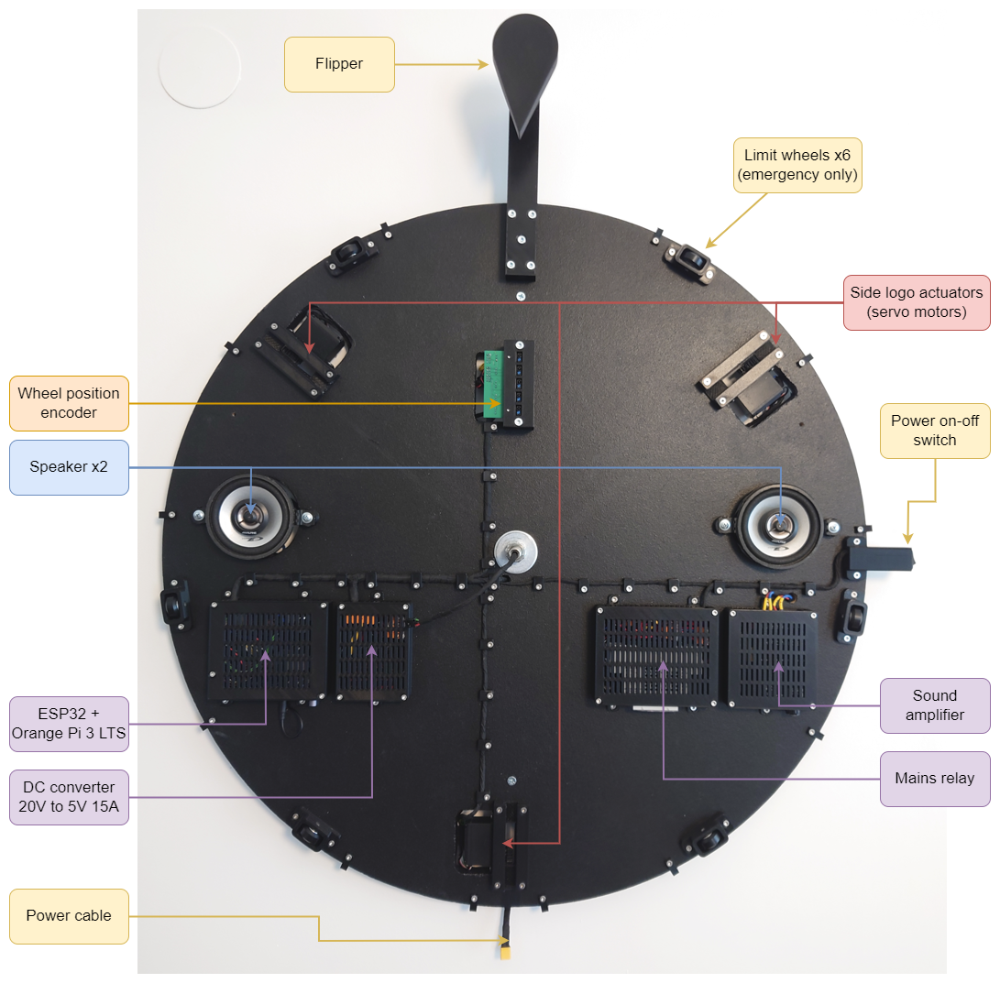

# Wheel of Fortune

## Overview

An over-engineered DIY version of Wheel of Fortune (Wheel or Prizes). The main features are:
* 3 LED strips with individually controllable LEDs (WLED)
* 3 linear servo motors for displaying effect logos
* absolute position optical encoder for wheel position (position depended effects)
* Amplified sound system for theme and effect sound
* ESP32 based LED and servo motor controller
* Orange PI 3 LTS based compute unit
* Node (React + Mantine) app for configuration
* Server stack for metrics, monitoring and backup




Here only general overview of the system is given. For detailed instructions how to build the system, see following readme files:

1. [Mechanical setup](tree/main/hw/mech)
1. [Electrical setup](tree/main/hw/electrical)
1. [Embedded software](tree/main/hw/embedded_software)
1. [Server software](tree/main/hw/server)


## Development

Code is split to two main parts:
1. [Python backend](tree/main/wheel_of_fortune) (FastAPI)
1. [Node frontend](tree/readme/wheel_of_fortune/frontend) (React + Mantine)

Finally, frontend static HTML + Javascript files are backed into backend Python package and served via backend FastAPI server. 

### Backend

#### Development environment

Python 3.11 is currently preferred, but should also work on any Python >= 3.10

```bash
python -m venv venv
source venv/bin/activate
pip install -r dev-requirements.txt
pip install -e .
```

#### Running backend

```bash
source venv/bin/activate
python -m wheel_of_fortune
```

#### Updating requirements

After adding dependency update requirement files by running:

```bash
source venv/bin/activate
pip-compile --upgrade -o requirements.txt pyproject.toml \
    && pip-compile --extra dev --upgrade -o dev-requirements.txt pyproject.toml \
    && pip-sync dev-requirements.txt
```

### Frontend

#### Setup development environment

Install `nvm` and `node` and install dependencies:

```bash
cd wheel_of_fortune/frontend/
curl -o- https://raw.githubusercontent.com/nvm-sh/nvm/v0.39.4/install.sh | bash
source ~/.bashrc
nvm install
nvm use
npm ci
```

#### Developer mode

Create `.env.local` file for overriding environment:

```bash
VITE_API_URL=https://wheel.int.example.com/api/v1
VITE_WS_URL=wss://wheel.int.example.com/api/v1/ws
```

Run frontend in `dev` mode:

```bash
nvm use
npm run dev
```

#### Release build

```bash
nvm use
npm run build
```

#### Update packages

To update `package-lock.json` and install updates:

```bash
npm update
npm install
```

To also update `package.json` file:

```bash
npm install -g npm-check-updates
ncu -u
npm install
```


### Build steps

Usually not needed, as [Github actions](tree/main/.github/workflows) automatically build and test frontend & docker images. But for completeness, here are commands to do build manually:

#### Frontend

```bash
cd wheel_of_fortune/frontend/
nvm use
npm ci
npm run build
cd ../..
```

#### Backend

```bash
python -m build
```

#### Docker image

```bash
docker build -t wheel_of_fortune .
```
