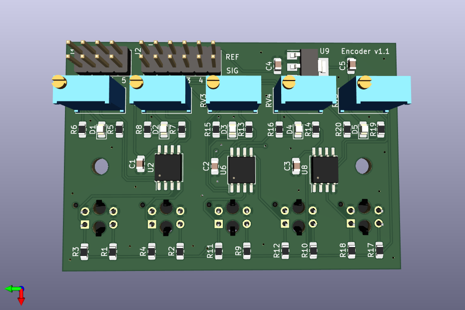
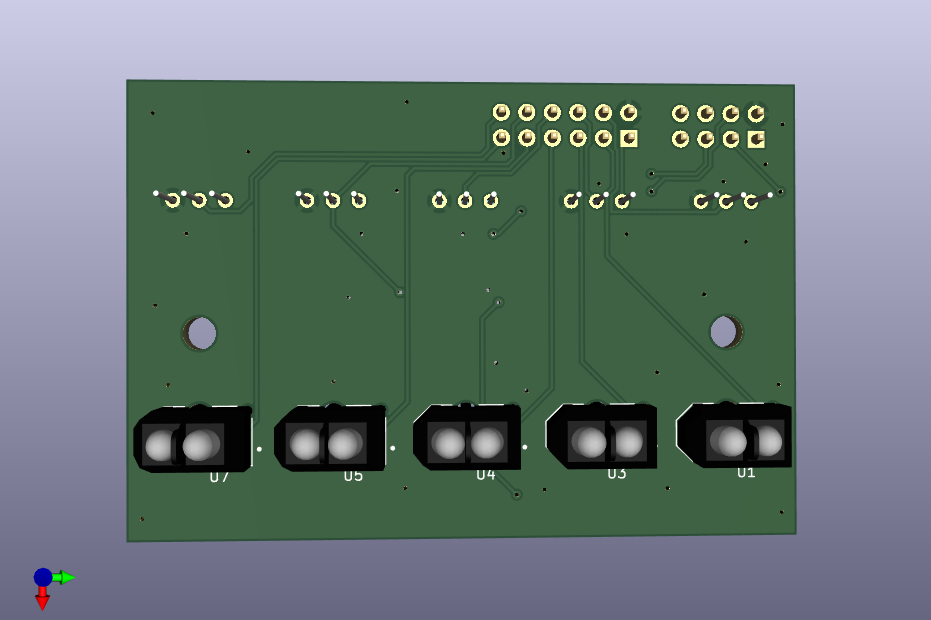

## Line sensor encoder

Back                                        |  Front
:------------------------------------------:|:------------------------------------------:
  |  

Custom encoder PCB for detecting absolute position of the wheel.
It consists of 5 `TCRT5000L` line sensors combined with voltage comparators
to have five binary outputs.

[PDF schematic](line_sensor_encoder.pdf)
