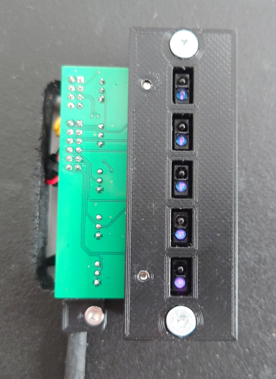

# Mechanical design

This file contains documentation for the mechanical design. It is structured as a step-by-step guide to fabricate all necessary components and assemble them together.

NB: Not all details are included in this guide, please consult with the [bill of materials (BOM)](../bom/bom.pdf) and 3D models for complete information.

## 3D printed parts

* Printer: Ender-3 V2 (Trianglelab DDB Extruder V2.0 + BLTouch)
* Slicer: Ultimaker Cura 4.11.0

Rigid parts (PLA+):

* Filamant: eSun PLA+ 1.75mm 1kg Black
* Profile: Standard Quality
* Printing temperature: 210 °C
* Build Plate Temperature: 60 °C
* Initial layer horizontal expansion: -0.1 mm
* Generate support: yes (if needed)

Flexible parts (TPU):

* Filament: Overture TPU Filament, 1.75 mm, black
* Profile: Standard Quality
* Printing temperature: 210 °C
* Build Plate Temperature: 60 °C
* Print speed: 10 mm/s
* Enable retraction: False
* Initial layer horizontal expansion: -0.1 mm

## Wheel assembly

[Drawing PDF](wheel/wheel%20drawing.pdf)

[Assembly 3D model](wheel/wheel%20assembly.STL)

### Cut out the wheel

Use drawing to cut out a circle (wheel) from 18 mm thick plywood / particle board. Do not drill any holes yes, before attaching encoder pattern (next step).

### Paint the wheel

Finish the wheel with blackboard paint on the one side and optionally also paint the back side of the wheel (any color). Use appropriate color edge banding to finish the edge.

### Print and glue encoder pattern 

Print [encoder pattern](wheel/encoder_pattern/pattern.pdf) to `A2` sized paper and cut the excess paper outside the pattern (less paper to glue). Use spray glue (or similar) to glue the patter exactly to the center of the wheel.

### Drill holes

Now rest of the holes can be drilled by following the markings on the encoder pattern (center hole, 4 mounting holes and 16 holes for sector separators). To accurately drill the holes for the sector separation rods, it is possible to use following 3D printed [drill aid](wheel/drill%20aid.STL) (needs `605zz 5x14x5mm` bearings or similar, 5 pcs)

### Draw sector separation lines

Use waterproof permanent marker to draw lines between sectors.

### Attach sector separation rods

Attach rods between sectors. Consult [BOM](../bom/bom.pdf) for details.

### Bearing hub

First, print extension to the bearing hub [STL](wheel/bearing%20hub%20ext.STL) as of the shelf bearing hub is not meant to have two bearings inside the hub side-by-side.

Secondly, drill 4 holes into a large washer (`DIN125 M33`) for M5 countersunk heads. Use [drill aid](wheel/drill%20aid%202.STL) (needs `605zz 5x14x5mm` bearings or similar, 4 pcs)

Finally, insert two `SKF6201` (or similar) bearings into the bearing hub and attach them to the wheel by 4 screws (details in [BOM](../bom/bom.pdf)).

### Finishing up

Last step of the wheel assembly is to write names to different sectors to your liking. Liquid chalk markers can be used.

## Backplate assembly

[Drawing PDF](backplate/backplate%20drawing.pdf)

[Assembly 3D model](backplate/backplate%20assembly.STL)

### Cut out backplate

Use 18 mm thick plywood / particle board to cut out a circle with 700 mm diameter. As backplate has many holes for mounting sub-assemblies and for passing wires it is advised to print out [drawing](backplate/backplate%20drawing.pdf) to `A0` sized paper and use it as a stencil. This is probably the easiest way to accurately drill/saw all the necessary holes. Also, the stencil can be used in assembly phase to mount all the sub-assemblies correctly.

NB: all/most smaller holes do not need to be drilled, as they are just position markers for wood screws.

### Linear actuator sub-assembly

### Limit wheel sub-assembly

There are 6 limit wheels for stopping the wheel if it is bent by using considerable about of force. In other words, they are only for limiting the movement of the wheel in extreme cases to avoid damaging other components between the wheel and the backplate.

It uses 3D printer pulley wheels and custom 3D printed mount. Consult [BOM](../bom/bom.pdf) for details.

[3D printed parts](backplate/limit%20wheel/limit%20wheel%20assembly.STL)

[Assembly 3D model](backplate/limit%20wheel/limit%20wheel%20assembly.STL)

### Encoder sub-assembly

Encoder sub-assembly if for attaching encoder PCB to the backplate.

[3D printed parts](backplate/encoder)

[Assembly 3D model](backplate/encoder/encoder%20assembly.STL)

### Compute sub-assembly

Compute sub-assembly holds Orange Pi 3 LTS and Olimex ESP32 POE boards. 

[3D printed parts](backplate/compute)

[Assembly 3D model](backplate/compute/compute%20assembly.STL)

### DC converter sub-assembly

DC converter module is for mounting the main DC voltage converter (20 to 5 V). Works as a main power distribution box, as almost everything is powered by 5 V.

[3D printed parts](backplate/dc%20converter)

[Assembly 3D model](backplate/dc%20converter/dc%20converter%20assembly.STL)

### Power relay sub-assembly

Power relay module is the main distribution box for 20 V and it also is responsible for switching off the wheel electronics with delay to allow graceful shutdown of the Orange PI board.

[3D printed parts](backplate/power%20relay)

[Assembly 3D model](backplate/power%20relay/power%20relay%20assembly.STL)

### Amplifier sub-assembly

Mounts sound amplifer and ground loop isolator.

[3D printed parts](backplate/amplifier/)

[Assembly 3D model](backplate/amplifier/amplifier%20assembly.STL)

### Flipper sub-assembly

### Power switch sub-assembly

### Speakers

## Cover logo assembly

[Assembly 3D model](cover/cover%20assembly.STL)

## Final assembly

